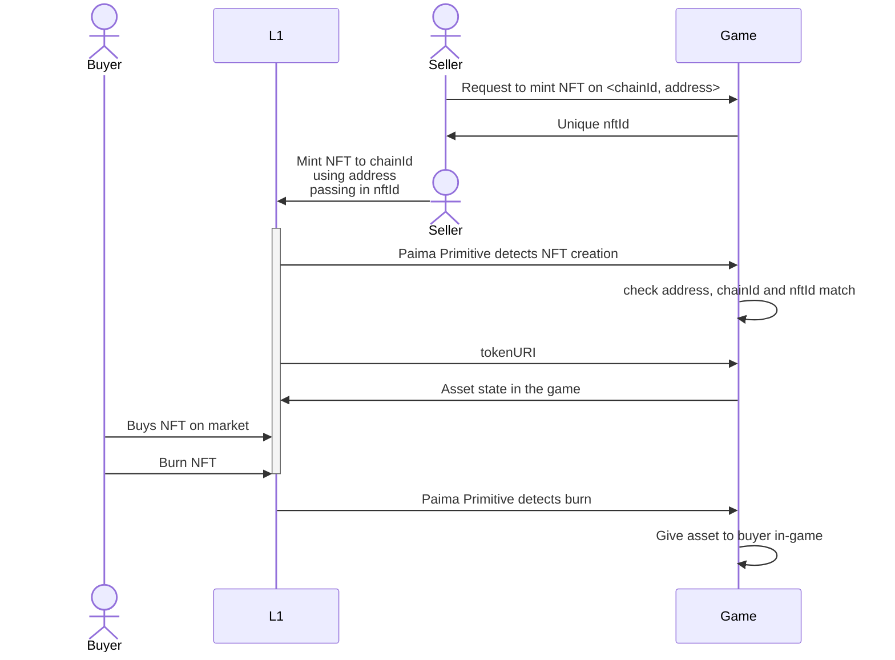

## Abstract

Allows tradability of game state directly on a more popular network helps achieve a lot more composability and liquidity than would otherwise be possible. This standard helps define how to define NFTs in different chains without introducing centralization or lowered security.

## Motivation

Many games, due to being data and computation heavy applications, run on sidechains, L2s and appchains as opposed to popular L1 blockchains. This is problematic because liquidity for trading assets live primarily on the L1s (a different environment). A common solution to this problem is building an NFT bridge, but bridges have a bad reputation and bridging also makes upgrading the game harder as any update to the game state may now also require you to update the data associated with all the bridged state (ex: adding a new field for monsters in the game would require you to introduce this new field to all bridged assets).

Instead of bridging NFTs, this standard allows minting NFTs on more popular chains that ask as a pointing to game state, which allows keeping the game as the source of truth for game state.

## Specification

Every PRC-3 compliant contract must implement the `IInverseProjectedNft` interface:

```solidity
/// @dev A standard ERC721 that accepts calldata in the mint function for any initialization data needed in a Paima dApp.
interface IInverseProjectedNft is IERC4906 {
    /// @dev Emitted when `baseExtension` is updated from `oldBaseExtension` to `newBaseExtension`.
    event SetBaseExtension(string oldBaseExtension, string newBaseExtension);

    /// @dev Emitted when `baseUri` is updated from `oldUri` to `newUri`.
    event SetBaseURI(string oldUri, string newUri);

    /// @dev Burns token of ID `_tokenId`. Callable only by the owner of the specified token.
    /// Reverts if `_tokenId` is not existing.
    function burn(uint256 _tokenId) external;

    /// @dev Sets `_URI` as the `baseURI` of the NFT.
    /// Callable only by the contract owner.
    /// Emits the `SetBaseURI` event.
    function setBaseURI(string memory _URI) external;

    /// @dev Sets `_newBaseExtension` as the `baseExtension` of the NFT.
    /// Callable only by the contract owner.
    function setBaseExtension(string memory _newBaseExtension) external;

    /// @dev Returns the token URI of specified `tokenId` using a custom base URI.
    function tokenURI(
        uint256 tokenId,
        string memory customBaseUri
    ) external view returns (string memory);
}
```

We recommend the URI follows the following standard:

```bash
https://${rpcBase}/inverseProjection/${purpose}/${chainIdentifier}/${identifier}.json
```

Where
- `rpcBase` is the URI for the RPC
- `purpose` is a app-dependent string to describe what the NFT is for (ex: `monsters`)
- `chainIdentifier` is a unique ID for the chain following [caip-2](https://github.com/ChainAgnostic/CAIPs/blob/main/CAIPs/caip-2.md)
- `identifier` is the unique ID for the NFT (more on this later)

An example of such a `baseURI` is `https://rpc.mygame.com/inverseProjection/monsters/eip155:1/`

### Token Identifier

There are two possible ways to define the token identifier with different tradeoffs.

#### 1) App Initiated

In this case, the user first initiates the projection on the game layer by specifying the chain ID they want to project data to. The game then provides the user with a unique `nftId` to use as the `identifier`.



This case uses the following extension to the base interface

```solidity
/// @dev A Paima Inverse Projection NFT where initialization is handled by the app-layer.
interface IAppInverseProjectedNft is IInverseProjectedNft {
    /// @dev Emitted when a new token with ID `tokenId` is minted for id `nftId` with `initialData` provided in the `mint` function parameters.
    event Minted(uint256 indexed tokenId, uint256 indexed nftId, string initialData);

    /// @dev Mints a new token to address `_to` corresponding to `nftId`, passing `initialData` to be emitted in the event.
    /// Increases the `totalSupply` and `currentTokenId`.
    /// Reverts if `totalSupply` is not less than `maxSupply` or if `_to` is a zero address.
    /// Emits the `Minted` event.
    function mint(address _to, uint256 nftId, string calldata initialData) external returns (uint256);
}
```

The smart contract is required to ensure the combination of `<address, nftId>` is unique across all mints

#### 2) Base Layer Initiated

In this case, the user first initiates the projection on the base layer by simply minting the NFT specifying data as needed in the `initialData`. The `tokenId` from the smart contract will act as the `identifier`.

There are 2 error-cases to handle:
1. Querying a `tokenID` that has not yet been seen by the game node. This should return a `404 error` instead of dummy data (to avoid NFT marketplaces caching dummy data)
2. Querying a `tokenID` 

This case uses the following extension to the base interface

```solidity
/// @dev A Paima Inverse Projection NFT where initialization is handled by the base-layer.
interface IBaseInverseProjectedNft is IInverseProjectedNft {
    /// @dev Emitted when a new token with ID `tokenId` is minted, with `initialData` provided in the `mint` function parameters.
    event Minted(uint256 indexed tokenId, string initialData);

    /// @dev Mints a new token to address `_to`, passing `initialData` to be emitted in the event.
    /// Increases the `totalSupply` and `currentTokenId`.
    /// Reverts if `totalSupply` is not less than `maxSupply` or if `_to` is a zero address.
    /// Emits the `Minted` event.
    function mint(address _to, string calldata initialData) external returns (uint256);
}
```

### Invalid mint response

TODO: define the format for malicious mints

## Rationale

Instead of holding the data for the NFT in IPFS or other immutable storage, the NFT instead encodes which RPC call needs to be made to the game node to fetch the data this NFT encodes. Note that for this standard to be secure, you cannot mint these NFTs on arbitrary chains - rather, it has to be on a chain that the game is either actively monitoring (or occasionally receives updates about through a bridge or other mechanism).

Key differences from ERC721:
- `mint` can be called by anybody at anytime (infinite supply) and includes an `initialData` to pass in any other necessary data for the game, as well as possibly an `nftId` depending on which layer initiates the projection.
- `tokenURI` from `IERC721` will lookup from default RPC for the game to ensure data is properly visible from standard marketplaces like OpenSea. To avoid this being a point of decentralization, there is an additional `tokenURI` function that accepts a `customBaseUri` for marketplaces / users to provide their own RPC if they wish.
- The contract uses [ERC-4906](https://eips.ethereum.org/EIPS/eip-4906) to force marketplaces to invalidate their cache. This function is callable by anybody (not just the admin) so that if ever the game updates with new features (either user-initiated or by the original authors of the game), marketplaces will properly refetch the data.

### Rationale A:

## Reference Implementation

https://github.com/PaimaStudios/paima-engine/blob/master/packages/contracts/evm-contracts/contracts/token/InverseProjectedNft.sol

## Security Considerations

TODO

## Copyright

Copyright and related rights waived via [CC0](../LICENSE.md).
