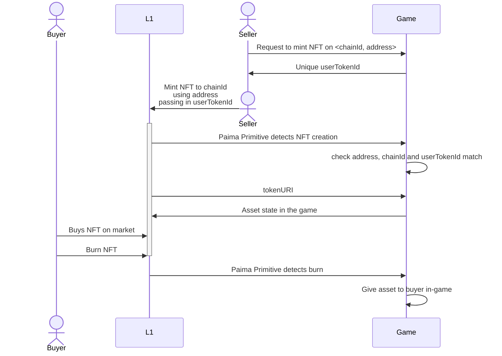
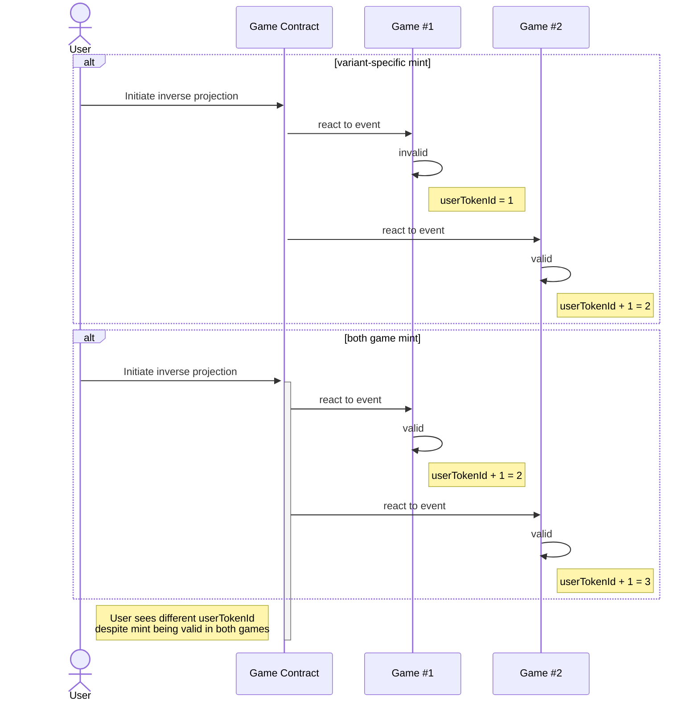
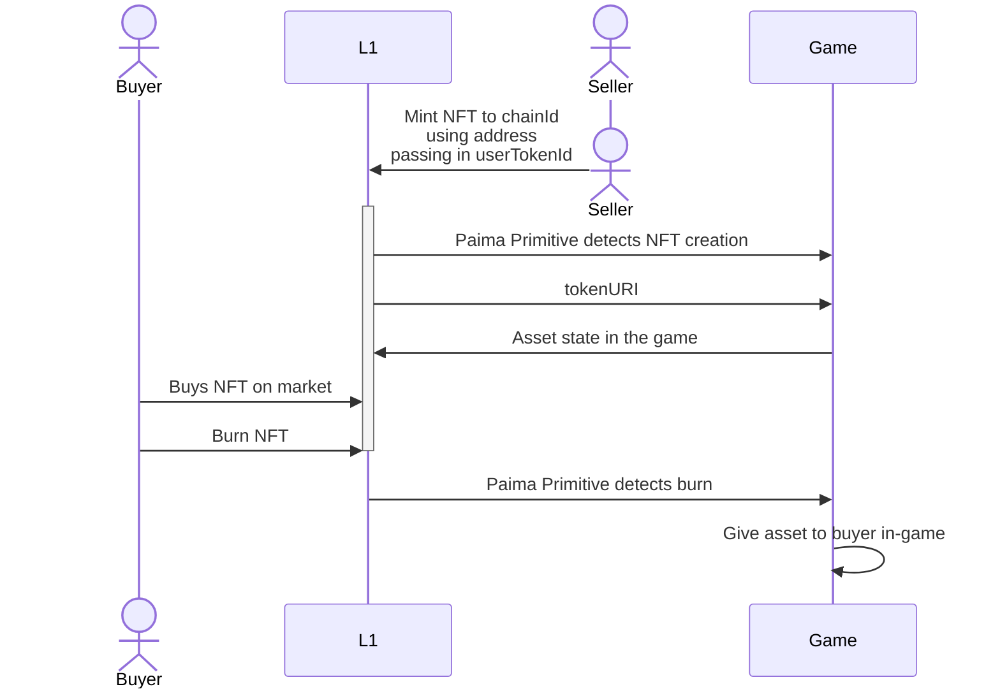

## Abstract

Allowing tradability of game state directly on popular networks helps achieve a lot more composability and liquidity than would otherwise be possible. This standard helps define how to define NFTs in different chains without introducing centralization, lowered security or wait times for finality.

## Motivation

Many games, due to being data and computation heavy applications, run on sidechains, L2s and appchains as opposed to popular L1 blockchains. This is problematic because liquidity for trading assets live primarily on the L1s (different environments). A common solution to this problem is building an NFT bridge, but bridges have a bad reputation, often require a long delay (especially for optimistic bridges which often require 1 week), and bridging also makes upgrading the game harder as any update to the game state may now also require you to update the data associated with all the bridged state (ex: adding a new field for monsters in the game would require you to introduce this new field to all bridged assets).

Instead of bridging NFTs, this standard allows minting NFTs on more popular chains that acts as a pointing to game state. This allows keeping the game as the source of truth for game state.

## Specification

Every PRC-3 compliant contract must implement the `IInverseProjectedNft` interface:

```solidity
/// @dev A standard ERC721 that can be burned and has a special tokenURI function accepting a custom base URI.
interface IInverseProjectedNft is IERC4906 {
    /// @dev Emitted when `baseExtension` is updated from `oldBaseExtension` to `newBaseExtension`.
    event SetBaseExtension(string oldBaseExtension, string newBaseExtension);

    /// @dev Emitted when `baseUri` is updated from `oldUri` to `newUri`.
    event SetBaseURI(string oldUri, string newUri);

    /// @dev Burns token of ID `_tokenId`. Callable only by the owner of the specified token.
    /// Reverts if `_tokenId` is not existing.
    function burn(uint256 _tokenId) external;

    /// @dev Sets `_URI` as the `baseURI` of the NFT.
    /// Callable only by the contract owner.
    /// Emits the `SetBaseURI` event.
    function setBaseURI(string memory _URI) external;

    /// @dev Sets `_newBaseExtension` as the `baseExtension` of the NFT.
    /// Callable only by the contract owner.
    function setBaseExtension(string memory _newBaseExtension) external;

    /// @dev Returns the token URI of specified `tokenId` using a custom base URI.
    function tokenURI(
        uint256 tokenId,
        string memory customBaseUri
    ) external view returns (string memory);
}
```

We recommend the following baseURI:

```bash
https://${rpcBase}/inverseProjection/${purpose}/${chainIdentifier}/
```

Where
- `rpcBase` is the URI for the RPC
- `purpose` is a app-dependent string to describe what the NFT is for (ex: `monsters`)
- `chainIdentifier` is a unique ID for the chain following [caip-2](https://github.com/ChainAgnostic/CAIPs/blob/main/CAIPs/caip-2.md)

An example of such a `baseURI` is `https://rpc.mygame.com/inverseProjection/monsters/eip155:1/`

### Token Identifier

There are two possible ways to define the token identifier with different tradeoffs.

#### 1) App Initiated

In this case, the user first initiates the projection on the app layer by specifying the chain ID they want to project data to as well as the address they will mint with. The game then provides the user with a unique `userTokenId`, and the identifier will be `${address}/${userTokenId}.json` where `userTokenId` is 1-indexed.

It will be up to the smart contract on the base layer to ensure the combination of `<address, userTokenId>` is unique across all mints. We RECOMMEND setting `userTokenId` to be an address-specific counter increasing in value starting from 1 to implement this.



This case uses the following extension to the base interface

```solidity
/// @dev A Paima Inverse Projection NFT where initialization is handled by the app-layer.
/// A standard ERC721 that can be freely minted and stores an unique <minter, userTokenId> pair (used in tokenURI) when minted.
interface IInverseAppProjectedNft is IInverseProjectedNft {
    /// @dev Emitted when the globally-enforced tokenId in combination with an unique <minter, userTokenId> pair is minted.
    event Minted(uint256 indexed tokenId, address indexed minter, uint256 indexed userTokenId);

    /// @dev Mints a new token to address `_to`
    /// Increases the `totalSupply` and `currentTokenId`.
    /// Reverts if `_to` is a zero address or if it refers to smart contract but does not implement IERC721Receiver-onERC721Received.
    /// Emits the `Minted` event.
    function mint(address _to) external returns (uint256);
}
```

**Note**: the state transition to initiate the inverse projection should *never* fail. If the data received to initiate the projection is invalid, the game should simply mark the data itself as invalid and still increment the user's value for `userTokenId`. This is because even though this inverse projection may be invalid for *this version* of the game, there may be another version of the game run by players where this state transition *is* valid. Failure to do this will result in different `userTokenId` for the same valid mint on 2 variants of the game (breaking interoperability).



There are 2 error-cases to handle:
1. Querying a `userTokenId` that has not yet been seen by the game node. This should not happen under normal use, but may happen if a user mints more times on the base layer without making any equivalent transaction in the app layer. This should return a `404 error` (to avoid NFT marketplaces caching dummy data)
2. Querying a `userTokenId` that is marked as invalid for this variation of the game. See [this section](#invalid-mint-response)

#### 2) Base Layer Initiated

In this case, the user first initiates the projection on the base layer by simply minting the NFT specifying data as needed in the `initialData`. The `tokenId` from the smart contract will act as the `identifier` (`${tokenId}.json`) where `tokenId` is 1-indexed.



This case uses the following extension to the base interface

```solidity
/// @dev A Paima Inverse Projection NFT where initialization is handled by the base-layer.
/// A standard ERC721 that accepts calldata in the mint function for any initialization data needed in a Paima dApp.
interface IInverseBaseProjectedNft is IInverseProjectedNft {
    /// @dev Emitted when the globally-enforced tokenId is minted, with `initialData` provided in the `mint` function parameters.
    event Minted(uint256 indexed tokenId, string initialData);

    /// @dev Mints a new token to address `_to`, passing `initialData` to be emitted in the event.
    /// Increases the `totalSupply` and `currentTokenId`.
    /// Reverts if `_to` is a zero address or if it refers to smart contract but does not implement IERC721Receiver-onERC721Received.
    /// Emits the `Minted` event.
    function mint(address _to, string calldata initialData) external returns (uint256);
}
```

There are 2 error-cases to handle:
1. Querying a `tokenID` that has not yet been seen by the game node. This will happen because there is always a delay between something happening on the base layer and the Paima node detecting it. This should return a `404 error` instead of dummy data (to avoid NFT marketplaces caching dummy data)
2. Invalid `initialData` provided (the definition of invalid is app-specific). See [this section](#invalid-mint-response)

#### Invalid mint response

The metadata returned for any invalid mint should be either:

1. Be a 404 permanently (easiest if your app does not store failed transactions)
2. Metadata that clearly (image, name, etc.) states the NFT is invalid and the only attribute is `attributes: [{ "value": "invalid" }]`.

## Rationale

Instead of holding the data for the NFT in IPFS or other immutable storage, the NFT instead corresponds to the RPC call that needs to be made to the game node to fetch the data this NFT encodes. Note that for this standard to be secure, you cannot mint these NFTs on arbitrary chains - rather, it has to be on a chain that the game is either actively monitoring (or occasionally receives updates about through a bridge or other mechanism).

Key differences from ERC721:
- `mint` can be called by anybody at anytime (infinite supply). If the projection is initiated by the base layer, it also needs to contain the `initialData` to specify what is being projected.
- `tokenURI` from `IERC721` will lookup from default RPC for the game to ensure data is properly visible from standard marketplaces like OpenSea. To avoid this being a point of centralization, there is an additional `tokenURI` function that accepts a `customBaseUri` for marketplaces / users to provide their own RPC if they wish.
- The contract uses [ERC-4906](https://eips.ethereum.org/EIPS/eip-4906) to force marketplaces to invalidate their cache. This function is callable by anybody (not just the admin) so that if ever the game updates with new features (either user-initiated or by the original authors of the game), marketplaces will properly refetch the data.

### Rationale App-layer

Having `userTokenId` be a deterministic increasing value not only avoids double-mints (creating 2 NFTs pointing to the same app data), it also avoids any issues with failed transactions (if a tx on the base layer fails, just create a new tx)

Upside:
- No need to wait for finality or bridge latency in the base layer for the game to detect the Paima Primitive and update the state machine to reflect the mint.

Downside:
- Requires a transaction on the layer where the app is deployed (although usually this is a place where tx fees are cheap) compared to when initiated on the base-layer which does not require an explicit app-layer transaction.
- Requires extra logic in the Solidity smart contract to avoid double-mints (only 1 address can claim any minted data in the base layer and ensure the address can claim it only once) which increases tx fees.
- ~175% the gas cost of the base-layer approach (130k ~ 175k gas)

### Rationale Base-layer

Upside:
- Lower gas cost because uniqueness is guaranteed by `tokenId` (no need for extra data structures to avoid double-mints)
- Does not require any transaction on the app layer
- 57% the gas cost of the app-layer approach (75k ~ 100k gas)

Downside:
- Extra `calldata` cost for `initialData`
- Need to wait for finality on the base layer (+ any bridge latency if the layer is not natively monitored by the app).
- Mints may fail if the mint is no longer valid by the time the app learns about it (ex: passing `initialData` to mint a monster the user no longer owns by the time the app sees the mint transaction)
- More complex game logic (ex: what happens if the user mints a monster and the mint transaction is seen when the monster is in a battle? You could decide to wait until the user has finished the battle to process the mint, but this adds extra complexity to your state machine).

## Reference Implementation

You can find all the contracts and interfaces in the Paima Engine codebase [here](https://github.com/PaimaStudios/paima-engine/blob/master/packages/contracts/evm-contracts/contracts/token/)

## Security Considerations

**Honest RPC**: This standard relies on the default RPC being honestly operated. This is, however, not really a new trust assumption because this is a required assumption in nearly all dApps at the moment (including those like OpenSea where you have to trust them to be operating their website honestly). Just like somebody can run their own Ethereum fullnode to verify the data they see in an NFT marketplace, they can also sync fullnode for a Paima app and use their own RPC to fetch the state.

**App layer finality**: If the app layer can rollback, it can cause the data from the RPC call to change or become invalid entirely. NFT marketplaces may not update their cache to reflect these changes right away, but can be force-updated by anyone using [ERC-4906](https://eips.ethereum.org/EIPS/eip-4906).

## Copyright

Copyright and related rights waived via [CC0](../LICENSE.md).
