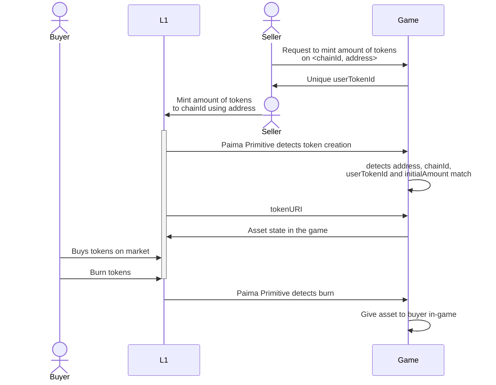
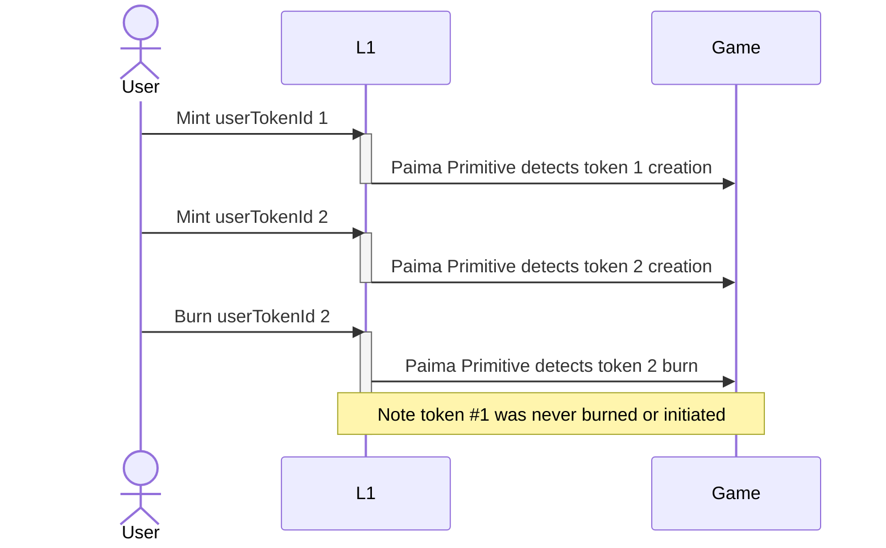
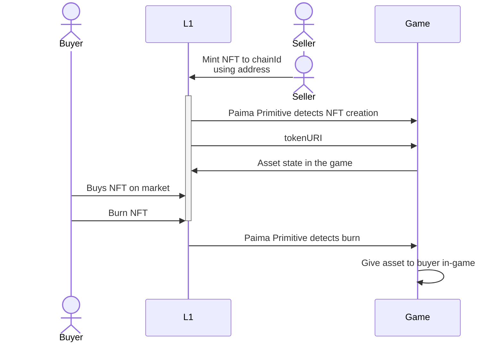
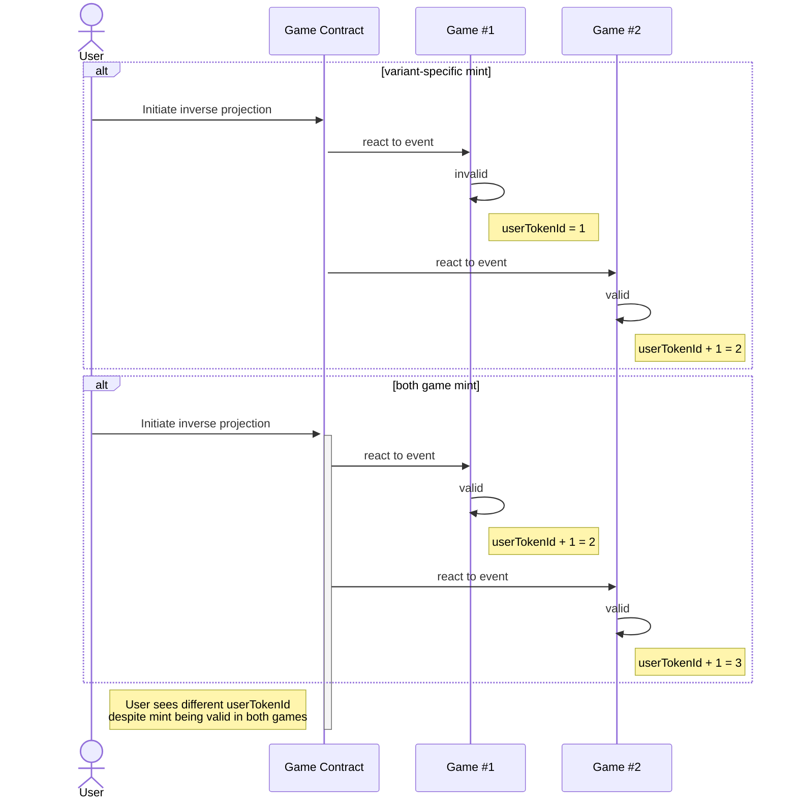

## Abstract

Allowing tradability of game state directly on popular networks helps achieve a lot more composability and liquidity than would otherwise be possible. This standard helps define how to define ERC1155 tokens in different chains without introducing centralization, lowered security or wait times for finality.

This proposal aims to replicate the mechanisms of PRC-3 (which deals with ERC721 tokens) for ERC1155 tokens.

## Motivation

Many games, due to being data and computation heavy applications, run on sidechains, L2s and appchains as opposed to popular L1 blockchains. This is problematic because liquidity for trading assets live primarily on the L1s (different environments). A common solution to this problem is building an token bridge, but bridges have a bad reputation, often require a long delay (especially for optimistic bridges which often require 1 week), and bridging also makes upgrading the game harder as any update to the game state may now also require you to update the data associated with all the bridged state (ex: adding a new field for monsters in the game would require you to introduce this new field to all bridged assets).

Instead of bridging tokens, this standard allows minting tokens on more popular chains that acts as a pointing to game state. This allows keeping the game as the source of truth for game state.

## Specification

Every PRC-5 compliant contract must implement the `IInverseProjected1155` interface:

```solidity
/// @dev A standard ERC1155 that can be burned and has a special uri function accepting a custom base URI.
interface IInverseProjected1155 is IERC1155MetadataURI, IERC4906Agnostic {
    /// @dev Emitted when `baseExtension` is updated from `oldBaseExtension` to `newBaseExtension`.
    event SetBaseExtension(string oldBaseExtension, string newBaseExtension);

    /// @dev Emitted when `baseUri` is updated from `oldUri` to `newUri`.
    event SetBaseURI(string oldUri, string newUri);

    /// @dev Burns `value` amount of token of ID `id` from transaction sender.
    /// Reverts if transaction sender's balance of `id` is less than `value`.
    function burn(uint256 id, uint256 value) external;

    /// @dev Sets `_URI` as the `baseURI`.
    /// Callable only by the contract owner.
    /// Emits the `SetBaseURI` event.
    function setBaseURI(string memory _URI) external;

    /// @dev Sets `_newBaseExtension` as the `baseExtension`.
    /// Callable only by the contract owner.
    function setBaseExtension(string memory _newBaseExtension) external;

    /// @dev Returns the token URI of specified `id` using a custom base URI.
    function uri(uint256 id, string memory customBaseUri) external view returns (string memory);
}

/// @title Agnostic Metadata Update Extension
interface IERC4906Agnostic {
    /// @dev This event emits when the metadata of a token is changed.
    /// So that the third-party platforms such as NFT market could
    /// timely update the images and related attributes of the token.
    event MetadataUpdate(uint256 _tokenId);

    /// @dev This event emits when the metadata of a range of tokens is changed.
    /// So that the third-party platforms such as NFT market could
    /// timely update the images and related attributes of the tokens.
    event BatchMetadataUpdate(uint256 _fromTokenId, uint256 _toTokenId);
}
```

With the following baseURI:

```bash
https://${rpcBase}/inverseProjection/${standard}/${purpose}/${chainIdentifier}/
```

Where
- `rpcBase` is the URI for the RPC
- `standard` is for the specific PRC used to define the the format of this endpoint (ex: `prc5`)
- `purpose` is a app-dependent string to describe what the NFT is for (ex: `gold`)
- `chainIdentifier` is a unique ID for the chain following [caip-2](https://github.com/ChainAgnostic/CAIPs/blob/main/CAIPs/caip-2.md)

An example of such a `baseURI` is `https://rpc.mygame.com/inverseProjection/prc5/gold/eip155:1/`

### Token Identifier

There are two possible ways to define the token identifier with different tradeoffs.

#### 1) App Initiated

In this case, the user first initiates the projection on the app layer by specifying the chain ID they want to project data to as well as the `userAddress` they will mint with and the `amount` of tokens. The game then provides the user with a unique `userTokenId`, and the identifier will be `${address}/${userTokenId}` where `userTokenId` is 1-indexed.  
The game must also note down the `initialAmount` of the locked assets, so that it can later compare this number with the `amount` of tokens the user mints on the base chain. In the event the user mints **less** tokens than is the number of assets that were locked, the game MUST react to this event by unlocking the difference back to the user.

It will be up to the smart contract on the base layer to ensure the combination of `<address, userTokenId>` is unique across all mints. We RECOMMEND setting `userTokenId` to be an address-specific counter increasing in value starting from 1 to implement this.



This case uses the following extension to the base interface

```solidity
/// @dev A Paima Inverse Projection ERC1155 token where initialization is handled by the app-layer.
/// A standard ERC1155 that can be freely minted and stores an unique `<minter, userTokenId>` pair (used in `tokenURI`) when minted.
interface IInverseAppProjected1155 is IInverseProjected1155 {
    /// @dev Emitted when `value` amount of globally-enforced `tokenId` in combination with an unique `<minter, userTokenId>` pair is minted.
    event Minted(
        uint256 indexed tokenId,
        address indexed minter,
        uint256 indexed userTokenId,
        uint256 value
    );

    /// @notice Returns the last nonce used (or 0 if the user has never minted)
    /// @dev Useful if you need to either needs to
    ///      1. Check if the nonce matches the expected value, or if more NFTs need to be minted
    ///      2. Use a nonce algorithm where the next nonce depends on the current nonce
    function currentNonce(address user) external view returns (uint256);

    /// @dev Mints `value` of a new token to the transaction sender.
    /// Increases the `currentTokenId`.
    /// Reverts if transaction sender is a smart contract that does not implement IERC1155Receiver-onERC1155Received.
    /// Emits the `Minted` event.
    /// @param value the amount of tokens to mint.
    /// @param data additional data to pass to the receiver contract.
    /// @param verificationData any additional data to verify the validity of the mint
    /// @return id of the minted token.
    function mint(
        uint256 value,
        bytes memory data,
        bytes memory verificationData
    ) external returns (uint256);

    /// @dev This works identically to the other function with an extra data parameter,
    ///      except this function just sets data to "".
    function mint(uint256 value, bytes memory data) external returns (uint256);
}
```

With the following recommendation for token URI:

```bash
${baseURI}${userAddress}/${userTokenId}/${initialAmount}
```

Where
- `baseURI` is the base URI specified above
- `userAddress` is the address of the user who initiated the projection
- `userTokenId` is the userAddress-specific identifier
- `initialAmount` is the initial amount of the specific minted tokens

An example of a resulting token URI is `https://rpc.mygame.com/inverseProjection/prc5/gold/eip155:1/0x1946a1DD383FE3c3cd9ae3066C638EF6ed7E35e5/1/1000`

##### Avoiding partial initialization

Additionally, apps SHOULD ask the user to sign all transactions first before actually submitting them to the network. This avoids a situation where the user makes a transaction in the game layer, but then rejects (or never signs) the transaction in the base layer (this isn't an invalid state as they can always mint the tx in the base layer later to continue where they left off, but it's poor UX).

In cases where this is not possible, the game CAN consider burn events for tokens that were never initiated on the app layer as already handled, but care needs to be taken for burn events that are out of sync



##### Endpoint error cases

There are 2 error-cases to handle:
1. Querying a `userTokenId` that has not yet been seen by the game node. This should not happen under normal use, but may happen if a user mints more times on the base layer without making any equivalent transaction in the app layer. This should return a `404 error` (to avoid NFT marketplaces caching dummy data)
1. Querying a `userTokenId` that is marked as invalid for this variation of the game. See [this section](#mint-validity)

#### 2) Base Layer Initiated

In this case, the user first initiates the projection on the base layer by simply minting the NFT specifying data as needed in the `initialData`. The `tokenId` from the smart contract will act as the `identifier` (`${tokenId}.json`) where `tokenId` is 1-indexed.



This case uses the following extension to the base interface

```solidity
/// @dev A Paima Inverse Projection ERC1155 token where initialization is handled by the base-layer.
/// A standard ERC1155 that accepts calldata in the mint function for any initialization data needed in a Paima dApp.
interface IInverseBaseProjected1155 is IInverseProjected1155 {
    /// @dev Emitted when `value` amount of globally-enforced `tokenId` is minted, with `initialData` provided in the `mint` function parameters.
    event Minted(uint256 indexed tokenId, string initialData);

    /// @dev Mints `value` of a new token to transaction sender, passing `initialData` to be emitted in the event.
    /// Increases the `currentTokenId`.
    /// Reverts if transaction sender is a smart contract that does not implement IERC1155Receiver-onERC1155Received.
    /// Emits the `Minted` event.
    /// Returns the id of the minted token.
    function mint(
        uint256 value,
        bytes memory data,
        string calldata initialData
    ) external returns (uint256);
}
```

##### Endpoint error cases

There are 2 error-cases to handle:
1. Querying a `tokenId` that has not yet been seen by the game node. This will happen because there is always a delay between something happening on the base layer and the Paima node detecting it. This should return a `404 error` instead of dummy data (to avoid NFT marketplaces caching dummy data)
2. Invalid `initialData` provided (the definition of invalid is app-specific). See [this section](#mint-validity)

### Mint validity

Background: collection offers are a common feature in NFT marketplaces allowing users to place a price on any asset in the collection instead of having to pick an individual token. Similarly, another feature known as "sweeping the floor" buys all tokens in a collection starting with the lowest value.

These two features need extra work to work for PRC-5 assets. This is because some mints may be "invalid", and we want to avoid users buying / sweeping invalid assets without realizing. Invalid assets should not be blocked entirely (because they may be valid for a different variation of the game), but users should be able to place a buy/sweep order according to the validity of a specific version of the game.

To enable these features to work, all tokens in the collection SHOULD contain the following attribute:
1. `attributes: [{ "trait_type": "validity", "value": "valid" }]` for valid mints
2. `attributes: [{ "trait_type": "validity", "value": "invalid" }]` for invalid mints

This will help users make trait-based collection offers for the tokens.

Note that there are actually 4-cases for the state of token attributes:
1. An HTTP 404 error (because the RPC used is down or because the mint hasn't been initialized yet)
1. An HTTP 404 error (because the mint is considered invalid. This may happen if the game node does not store failed transactions)
1. A valid response (`value: "valid"`) when `initialAmount` values match
1. An invalid response (`value: "invalid"`) when `initialAmount` values don't match

#### Tracking invalid mints

**Note**: regardless of which layer does the initialization, the state transition to process the inverse projection should *never* fail for any reason other than signature mismatch. If the data received to initiate the projection is invalid, the game should simply mark the data itself as invalid and still increment the user's value for `userTokenId`. This is because even though this inverse projection may be invalid for *this version* of the game, there may be another version of the game run by players where this state transition *is* valid. Failure to do this will result in different `userTokenId` for the same valid mint on 2 variants of the game (breaking interoperability).



## Rationale

Instead of holding the data for the tokens in IPFS or other immutable storage, the token instead corresponds to the RPC call that needs to be made to the game node to fetch the data this token encodes. Note that for this standard to be secure, you cannot mint these tokens on arbitrary chains - rather, it has to be on a chain that the game is either actively monitoring (or occasionally receives updates about through a bridge or other mechanism).

Key differences from ERC1155:
- `mint` can be called by anybody at anytime (infinite supply).
    - If the projection is initiated by the base layer, it also needs to contain the `initialData` to specify what is being projected.
    - If the projection is initiated by the app layer, it can pass optionally pass in `_verificationData` if the app layer state is verifiable.
- `uri` from `IERC1155` will lookup from default RPC for the game to ensure data is properly visible from standard marketplaces like OpenSea. To avoid this being a point of centralization, there is an additional `uri` function that accepts a `customBaseUri` for marketplaces / users to provide their own RPC if they wish.
- The contract uses [ERC-4906](https://eips.ethereum.org/EIPS/eip-4906) to force marketplaces to invalidate their cache. These functions are callable by anybody (not just the admin) so that if ever the game updates with new features (either user-initiated or by the original authors of the game), marketplaces will properly refetch the data. OpenZeppelin's implementation of the `IERC4906` interface extends the `IERC721` interface, which is the reason we use a custom `IERC4906Agnostic` interface that does not do that.

### Rationale App-layer

Having `userTokenId` be a deterministic increasing value not only avoids double-mints (creating multiple tokens pointing to the same app data), it also avoids any issues with failed transactions (if a tx on the base layer fails, just create a new tx)

Upside:
- No need to wait for finality or bridge latency in the base layer for the game to detect the Paima Primitive and update the state machine to reflect the mint.
- Supports cases when the game state is verifiable (ex: if the game is a ZK rollup whose state is posted to the same base layer you can verify if the mint is valid according to the game state)

Downside:
- Requires a transaction on the layer where the app is deployed (although usually this is a place where tx fees are cheap) compared to when initiated on the base-layer which does not require an explicit app-layer transaction.
- Extra work to coordinate submission of transactions on 2 chains at the same time
- Requires extra logic in the Solidity smart contract to avoid double-mints (only 1 address can claim any minted data in the base layer and ensure the address can claim it only once) which increases tx fees.
- Higher gas cost in comparison with the base-layer approach

### Rationale Base-layer

Upside:
- Lower gas cost because uniqueness is guaranteed by `tokenId` (no need for extra data structures to avoid double-mints)
- Does not require any transaction on the app layer
- Lower gas cost in comparison with the app-layer approach

Downside:
- Extra `calldata` cost for `initialData`
- Need to wait for finality on the base layer (+ any bridge latency if the layer is not natively monitored by the app).
- Mints may fail if the mint is no longer valid by the time the app learns about it (ex: passing `initialData` to mint gold the user no longer owns by the time the app sees the mint transaction)

## Reference Implementation

You can find all the contracts and interfaces in the Paima Engine codebase [here](https://github.com/PaimaStudios/paima-engine/blob/master/packages/contracts/evm-contracts/contracts/token/)

## Security Considerations

**Honest RPC**: This standard relies on the default RPC being honestly operated. This is, however, not really a new trust assumption because this is a required assumption in nearly all dApps at the moment (including those like OpenSea where you have to trust them to be operating their website honestly). Just like somebody can run their own Ethereum fullnode to verify the data they see in an NFT marketplace, they can also sync fullnode for a Paima app and use their own RPC to fetch the state.

**App layer finality**: If the app layer can rollback, it can cause the data from the RPC call to change or become invalid entirely. NFT marketplaces may not update their cache to reflect these changes right away, but can be force-updated by anyone using [ERC-4906](https://eips.ethereum.org/EIPS/eip-4906).

## Copyright

Copyright and related rights waived via [CC0](../LICENSE.md).
